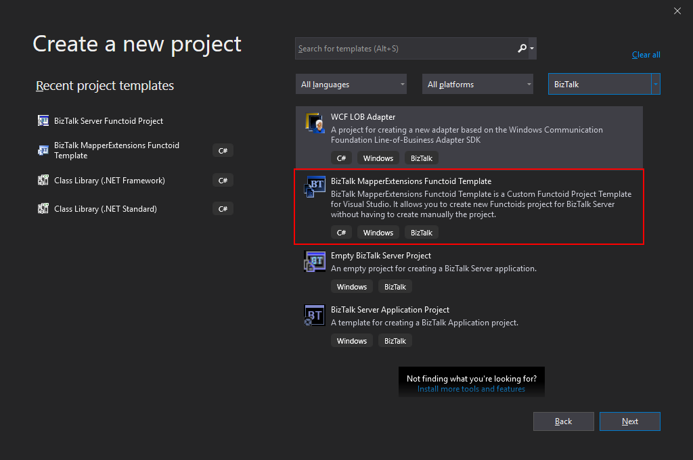
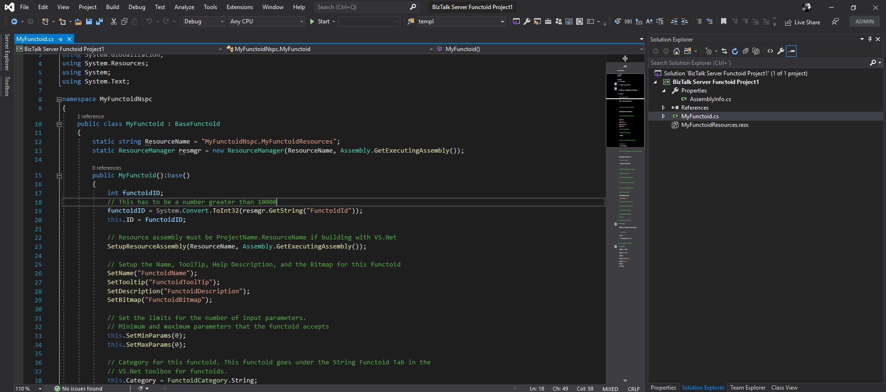

# BizTalk MapperExtensions Functoid Project Template
BizTalk MapperExtensions Functoid Project Template is a Custom Functoid Project Template for Visual Studio 2019. It allows you to create new Functoids project for BizTalk Server 2020 without having to create manually the project, in other words, having to manually create:
* A new class library project in Visual Studio;
* Add a reference to the Microsoft.BizTalk.BaseFunctoids assembly;
* Add New Class and having to code the entire class;

## Description
This Template will automatically create a project sample reference for you to create your custom Functoid. You them need to make the necessary changes and implement the required logic.

## Installation
To use this project template just download the BizTalk MapperExtensions Functoid Template.zip file and copy to the following location:
* C:\Users\<your-account>\Documents\Visual Studio 2019\Templates\ProjectTemplates

# About Me
**Sandro Pereira** | [DevScope](http://www.devscope.net/) | MVP & MCTS BizTalk Server 2010 | [https://blog.sandro-pereira.com/](https://blog.sandro-pereira.com/) | [@sandro_asp](https://twitter.com/sandro_asp)
